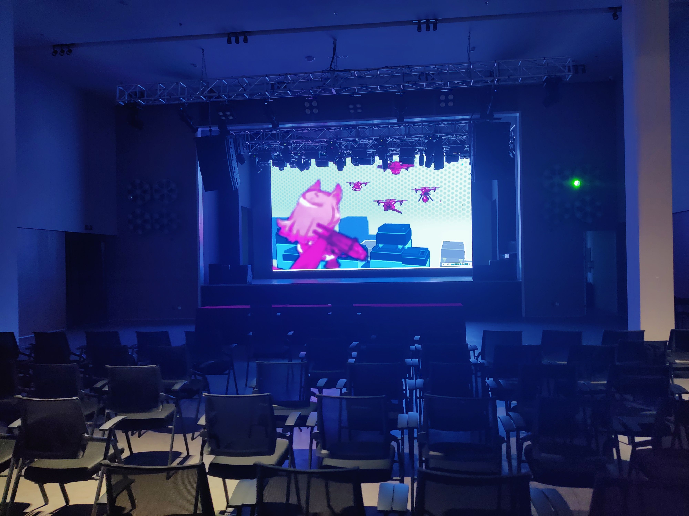
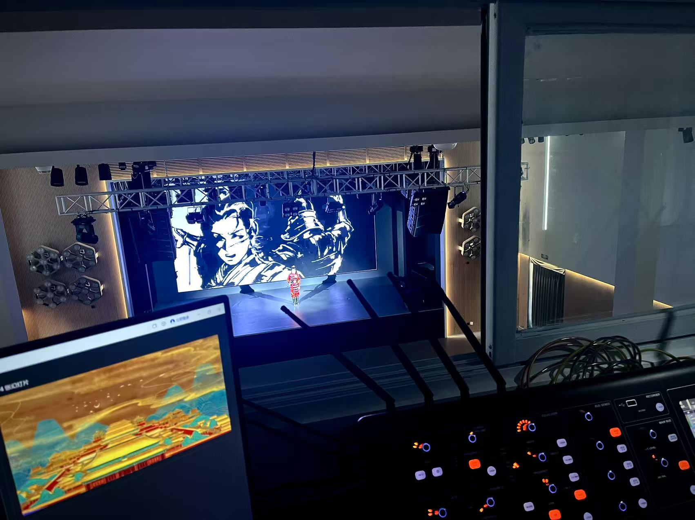
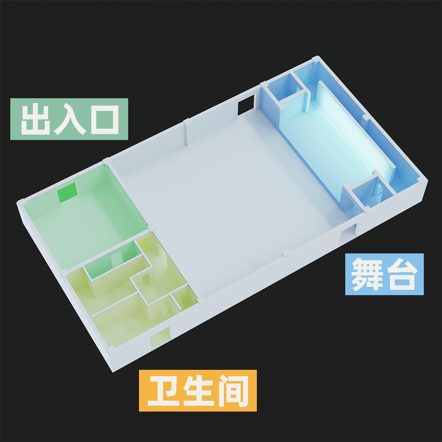
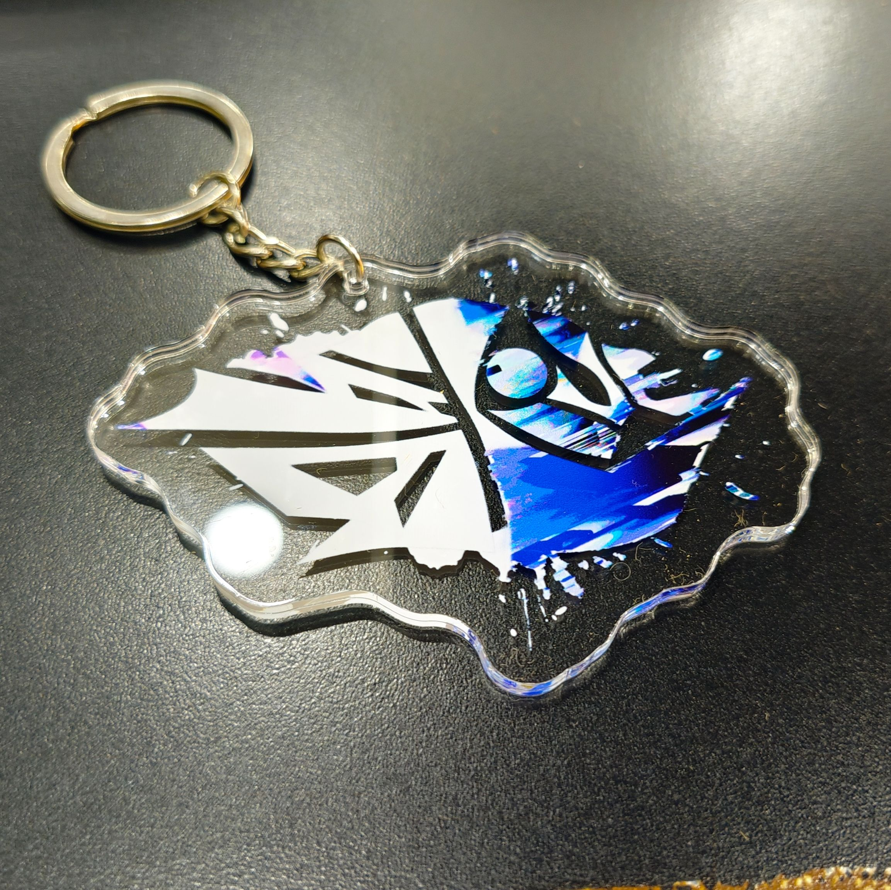
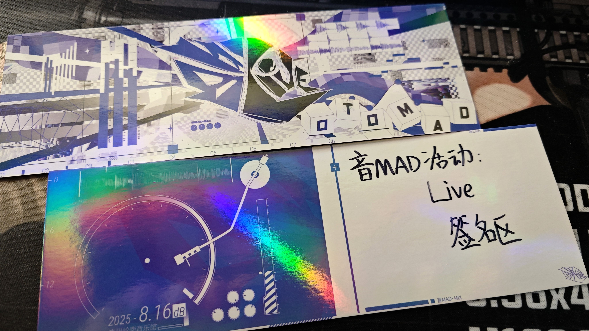
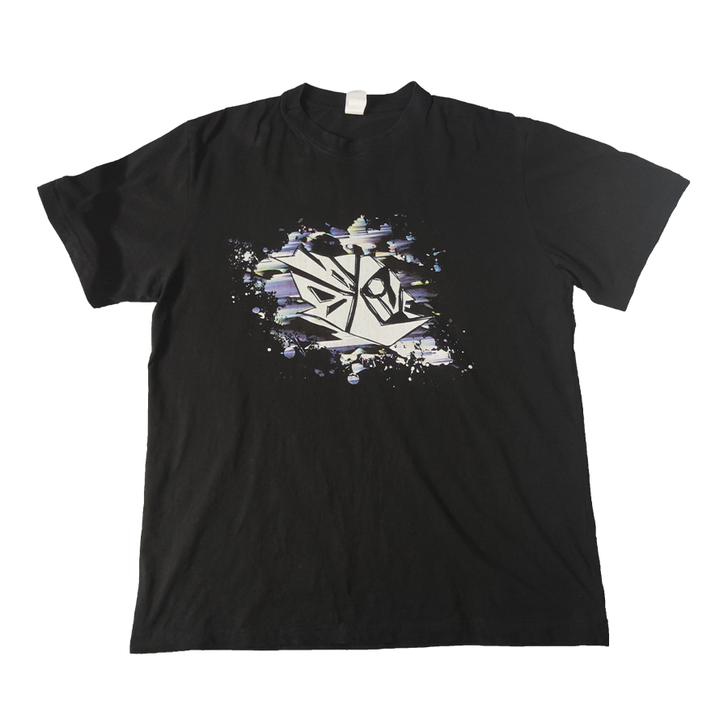

# 音MADイベント：LIVE

### 音MADイベント：LIVEにつきまして

【音MAD華】という「完全新作展映会」とは異なり

**音MADイベント：LIVEは、音MAD-MIXやDJ-SETを中心にしての音MADオフラインライブイベントです！**

### 開催日時

日本時間で2025年8月16日15時～21時

### 開催場所

  • 中国広東省広州市[岭南音乐馆（嶺南音楽館）](https://www.amap.com/place/B0JB31HE15)

嶺南音楽館は、広州市海珠区に設置され、地下鉄万胜围駅から約1.5キロ、徒歩25分またはタクシーでアクセスできます。

#### 会場へのアクセス

現在、日本国籍の方が中国を訪れる際には、ビサが不要となっています。

そのため、現地に行くためには航空券をご用意いただくだけで問題ありません。

日本からお越しの場合、最寄りの空港は広州白雲空港（CAN）です。アクセスの利便性を重視する方にはこちらがおすすめです。

一方、交通費を抑えたい方には、香港国際空港（HKG）への便がおすすめです。香港から広州までは、バス・フェリー・鉄道など様々な交通手段をご利用して、3時間以内広州へ到着できます。

広州に到着してからのアクセス：

上記は広州地下鉄線路図で、白雲空港で到着の方は3号線【机场南站(1号航站楼)駅】→【客村】→8号線乗り換え→【万胜围駅】

高速鉄道で到着の方（例えば香港国際空港到着で高速鉄道で広州に着く）は

2号線【广州南站駅】→【昌岗駅】→8号線乗り換え→【万胜围駅】

3号線【广州东站】→【客村】→8号線乗り換え→【万胜围駅】

で最寄り駅まで到着できます。

迷った方はAmapをご利用して、詳しい案内をもらえます。

 • Bilibili生放送
### 公式SNSアカウント：
  <!-- • [LIVE_音MAD暑期活动](https://space.bilibili.com/3537114090178943) -->
  

        

            
        

        

            

                公式SNSアカウント
            

            
LIVE_音MAD暑期活动

            

                

                    
                    <a href="https://space.bilibili.com/3537114090178943" target="_blank">bilibili</a>
                

            

        

    

### 運営スタッフ：

    

        

            
        

        

            

                運営スタッフ
            

            
MoonTDN

            

                

                    
                    <a href="https://space.bilibili.com/23655514" target="_blank">bilibili</a>
                

                <!-- 

                    
                    <a href="https://space.bilibili.com/3858957" target="_blank">niconico</a>
                

                

                    
                    <a href="https://space.bilibili.com/3858957" target="_blank">youtube</a>
                
 -->
            

        

    

    

        

            
        

        

            

                運営スタッフ
            

            
Esatain

            

                

                    
                    <a href="https://space.bilibili.com/16455886" target="_blank">bilibili</a>
                

                <!-- 

                    
                    <a href="https://space.bilibili.com/3858957" target="_blank">niconico</a>
                

                

                    
                    <a href="https://space.bilibili.com/3858957" target="_blank">youtube</a>
                
 -->
            

        

    

    

        

            
        

        

            

                運営スタッフ
            

            
FFFanwen

            

                

                    
                    <a href="https://space.bilibili.com/3858957" target="_blank">bilibili</a>
                

                <!-- 

                    
                    <a href="https://space.bilibili.com/3858957" target="_blank">niconico</a>
                

                

                    
                    <a href="https://space.bilibili.com/3858957" target="_blank">youtube</a>
                
 -->
            

        

    

    

        

            
        

        

            

                運営スタッフ
            

            
DaKeYoob74

            

                

                    
                    <a href="https://space.bilibili.com/11560725" target="_blank">bilibili</a>
                

                <!-- 

                    
                    <a href="https://space.bilibili.com/3858957" target="_blank">niconico</a>
                

                

                    
                    <a href="https://space.bilibili.com/3858957" target="_blank">youtube</a>
                
 -->
            

        

    

    

        

            
        

        

            

                運営スタッフ
            

            
青枫愁云

            

                

                    
                    <a href="https://space.bilibili.com/3546394121996454" target="_blank">bilibili</a>
                

                <!-- 

                    
                    <a href="https://space.bilibili.com/3858957" target="_blank">niconico</a>
                

                

                    
                    <a href="https://space.bilibili.com/3858957" target="_blank">youtube</a>
                
 -->
            

        

    

    

        

            
        

        

            

                運営スタッフ
            

            
Miskplar

            

                

                    
                    <a href="https://space.bilibili.com/386404441" target="_blank">bilibili</a>
                

                <!-- 

                    
                    <a href="https://space.bilibili.com/3858957" target="_blank">niconico</a>
                

                

                    
                    <a href="https://space.bilibili.com/3858957" target="_blank">youtube</a>
                
 -->
            

        

    

    

        

            
        

        

            

                運営スタッフ
            

            
坏枪

            

                

                    
                    <a href="https://space.bilibili.com/6636705" target="_blank">bilibili</a>
                

                <!-- 

                    
                    <a href="https://space.bilibili.com/3858957" target="_blank">niconico</a>
                

                

                    
                    <a href="https://space.bilibili.com/3858957" target="_blank">youtube</a>
                
 -->
            

        

    

    

        

            
        

        

            

                運営スタッフ
            

            
大骗子不吃P

            

                

                    
                    <a href="https://space.bilibili.com/22571636" target="_blank">bilibili</a>
                

                <!-- 

                    
                    <a href="https://space.bilibili.com/3858957" target="_blank">niconico</a>
                

                

                    
                    <a href="https://space.bilibili.com/3858957" target="_blank">youtube</a>
                
 -->
            

        

    

### 公式グッズ

---

## 投稿募集につきまして

### 募集方式

本イベントには、「招待募集」と「公開募集」の２つの募集方式があります。

招待募集には様々な制限があり、特に海外の方とのやり取りが困難なため、公開募集という募集方式を設置しました。

参加したい方は以下のフォームを提出して下さい。

[音MAD：LIVE投稿公開募集用フォーム](https://docs.google.com/forms/d/1ibBaKGGwcbcBQ1kf93dbbfzSy1axxs46tafQT5-ixuI)

フォームを提出すると、運営スタッフが連絡します。そこで運営スタッフが投稿確認、進捗確認、作品受取などをします。

※作品には、一定の完成度、クオリティが求められます。ジャンル・テーマがイベントにふさわしくないと判断された場合は、参加をお断りする可能性がありますので、事前運営スタッフと相談してください。

### 募集時間

告知発表~2025年8月1日

### 注意事項

１．動画の長さについて特に制限がありませんが、7-15分ぐらいはオススメです。短すぎたり長すぎたりすると、イベント全体の進行に影響する可能性がありますので、予めご了承ください。

２．低俗、暴力などのセンシティブな内容、または誹謗中傷を目的とした内容はオススメしません。

３．通常の音MADは、本イベントの趣旨に合わない可能性があります。イベントのテーマに関しては、以下の作品をご参照ください

４．提出いただく作品は、会場でそのまま再生できる、音声と映像が揃った完全な動画ファイル（分割されていないもの）でお願いします。

###  ご参考になる作品
**1. 音MAD-MIX**

  • いろいろな音MADそのものを素材にして、元の動画に基づきまして加工し、一定のミックス・アレンジをした作品。

    <a rel="noopener noreferrer" target="_blank" href="https://www.bilibili.com/video/BV11o5Zz8Edc">
        
        
        

            
Slow Dance w/u

            
BV11o5Zz8Edc

        

    </a>

    <a rel="noopener noreferrer" target="_blank" href="https://www.bilibili.com/video/BV16a4y127aY/">
        
        
        

            
音MADmix.啊

            
BV16a4y127aY

        

    </a>

    <a rel="noopener noreferrer" target="_blank" href="https://www.bilibili.com/video/BV1PW52zsEMw/">
        
        
        

            
YTPMV-mix.nerdtronics3

            
BV1PW52zsEMw

        

    </a>

    <a rel="noopener noreferrer" target="_blank" href="https://www.bilibili.com/video/BV1w9iFeWExy/">
        
        
        

            
音MAD-mix.新家

            
BV1w9iFeWExy

        

    </a>

**2. 音MAD DJ-mix**

  • 数個の音MADをミックス、アレンジをして、現場の盛り上がりなどができる作品。

    <a rel="noopener noreferrer" target="_blank" href="https://www.bilibili.com/video/BV17NLBztE6z/">
        
        
        

            
【官录】nerdtronics3

            
BV17NLBztE6z

        

    </a>

2p 4:15 - 31:10 作者：owatax

2p 52:07 - 1:22:33 作者：柊マグネタイト

3p 14:35 - 45:33 作者：フロクロ（frog96）

4p 0:00 - 30:25 作者：原口沙輔

5p 0:00 - 32:36 作者：皿

5p 1:39:54 - 2:09:13 作者：芋タルト

*（nerdtronics3の全体アーカイブであり、DJ-mixは上記のタイムポイントにご参照ください。）*

    <a rel="noopener noreferrer" target="_blank" href="https://www.youtube.com/watch?v=dFEdCZ_AZck">
        
        
        

            
【소리믹스/SORIMIX】Random Access Otomaders

            
https://www.youtube.com/watch?v=dFEdCZ_AZck

        

    </a>

    <a rel="noopener noreferrer" target="_blank" href="https://www.bilibili.com/video/BV1251uYWETo/">
        
        
        

            
【音MAD/IIDX音乐の何意味混音带】OwOs Radio Vol.3 || Mixed By Kakenhi

            
BV1251uYWETo

        

    </a>

**3. その他の現場にふさわしい作品**

  • EDM類音MAD、SET類音MAD、音MAD合作、または音MAD-MIX、DJ-mixとは言えないが現場にふさわしくて、盛り上がりできる作品。

    <a rel="noopener noreferrer" target="_blank" href="https://www.bilibili.com/video/BV1PYakePE7Z/">
        
        
        

            
From 「华」，For YTPMVs

            
BV1PYakePE7Z

        

    </a>

    <a rel="noopener noreferrer" target="_blank" href="https://www.bilibili.com/video/BV1LM4m117vr/">
        
        
        

            
150BPM音MAD SET

            
BV1LM4m117vr

        

    </a>

    <a rel="noopener noreferrer" target="_blank" href="https://www.bilibili.com/video/BV1Q3aSehETW/">
        
        
        

            
冥府专船

            
BV1Q3aSehETW

        

    </a>

### 提出フォーマット：

  • 音声：48000Hz/ 24bit（推奨）

  • 映像：16:9 / 1920x1080/ MP4 / 30または60 FPS（推奨）

---

## FAQ：
#### １．このイベントに投稿する作品は、単品として投稿できますか？

本イベントで採用された作品は、当日に現地で初公開となります。そのため、開催日までは単品の投稿はお控えください。

イベントが終わると、単品としてご自由に投稿できます。受け取らなかった作品はご自由に投稿できます。

#### ２．提出した作品の修正はできますか？

提出後の修正はできますが、開催日の7日前までに運営スタッフへご連絡のうえ、修正済みのファイルをご提出ください。

#### ３．募集する作品は、数量制限がありますか？

原則として数量に制限はありませんが、イベント全体の時間を5時間以内に収めるため、提出いただいた作品の総尺がこれを超える場合、運営側で選考を行い、上映作品を決定させていただきます。

#### ４．複数の作品を投稿できますか？

はい、問題ございません。

#### ５．複数の人が作り上げた作品（合作）を投稿できますか？

はい、問題ございません。

#### ６．海外のイベントですが、行ってみたいです、どうすればいいですか？

現在のアクセスは便利で、日本の方も楽に来れます。海外からの方がいらっしゃるとうれしいですからぜひご検討下さい。

#### ７．チケット販売について知りたい

現場に行きたい海外の方はサイトでのチケット購入、または利用が難しいですので、直接運営スタッフにご連絡ください。

#### ８．会場には行けませんが生放送について知りたい

本イベントはBilibili生放送で配信します。配信リンクは開催前公式SNSアカウント、Xに公開します。

生放送は「動画配信」、「現場配信」の2つの配信でできます。配信は録画されますのでイベントが終わると公式SNSアカウントがアーカイブを投稿します。

#### ９．現場配信があるので自分の顔が写されたりする？

配信用のカメラは会場の後方に設置されますので、写されたくない方は撮影エリアに入らないようにご注意ください。

また、許可なく他人の顔が映った写真や動画を公開の場に投稿することはご遠慮ください。

#### １０．会場にドリンクが提供されますか

会場にはボトルウォーターは無料で提供されます、なお自分持参のドリンクもご自由に持ち込みできます。

#### １１．会場にはお荷物を置く場所がありますか

会場にはロッカーなどの荷物置き場が設置されませんので、お荷物は自分がホテルなどに置いてください。

#### １２．今回のイベントの具体的なタイムスケジュールを教えてください

本イベントの総所要時間は約5時間を予定しております。

イベント開始の1時間前には開場および準備時間が設けられています。

上映中は、各作品の合間に休憩時間も挟む予定です。

各作品の上映時間は、概ね5～20分程度となります。

詳細なタイムスケジュール（各作品の上映順・時間帯を含む）は、イベント開催前に公式アカウント、Xでのお知らせいたしますので、続報をぜひご確認ください。

#### １３．今回のイベントに参加する作者を教えてください

現時点では、約30名の制作者の参加を予定しております。

ただし、現在も制作初期段階であり、募集も継続中のため、最終的な参加者は変更となる可能性がございます。

そのため、現時点では参加者の具体的なリストは非公開となっております。

最終的な出演者リストおよびプログラムの詳細は、イベント開催の約2週間前を目処に発表予定です。公式からの続報をぜひお見逃しなく！

